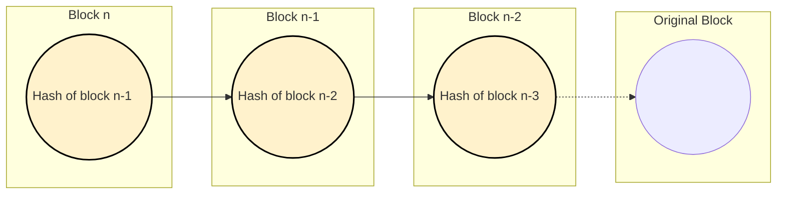

# Data Structure

The blockchain shares some similarity to a [linked list](https://en.wikipedia.org/wiki/Linked_list) data structure. Both are linear data sequences.  Linked lists contain pointers that link to successive nodes. This means when a new node is added to the linked list, the preexisting node gets a reference to the new node. A blockchain is a sequence of blocks that links to the previous block using a cryptographic hash. This means when a new block is added to the chain, it references the preexisting block.

The data that is stored in each block is hashed.  The hash is a one way encryption of the transactions, a timestamp, a nonce (random number), and the previous block's hash.  The hash is a fixed size and serves as an ID for the data in the block. When a new block is created it includes the previous block's hash.  This creates **data immutability** because if any data is changed it will invalidate successive block. 

In the graph below, the left most block labeled **Block n** represents the most recently created block. It points to the previous block.  The arrow indicates a link based on the hash of the previous block.  Each block going to the right represents the previous block in the chain.  The original block is shown using a dotted line to indicate there may be many more blocks between `Block n-2` and the start of the blockchain.

