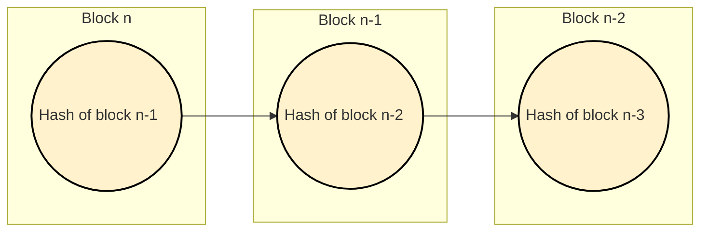

# Blockchain Data Structure

The blockchain is like a [doubly linked list](https://en.wikipedia.org/wiki/Doubly_linked_list) data structure in that they are both linear data structures connected in sequence.  Doubly linked lists contain pointers that reference nodes in front of and behind them, while blocks hold data that contains the hash of the previous block.

The data that is stored in each block is hashed.  The hash is a one way encryption of the transactions, a timestamp, a nonce (random number), and the previous block's hash.  The hash is a fixed size and serves as an ID for the data in the block. When a new block is created it includes the previous block's hash.  This creates **data immutability** because if any data is changed it will invalidate successive block. 

In the graph below, the left most block labeled **Block n** represents the most recently created block. It points to the previous block.  The arrow indicates that the pointer contains a hash of the previous block.  Each block going to the right represents the previous block in the chain.

