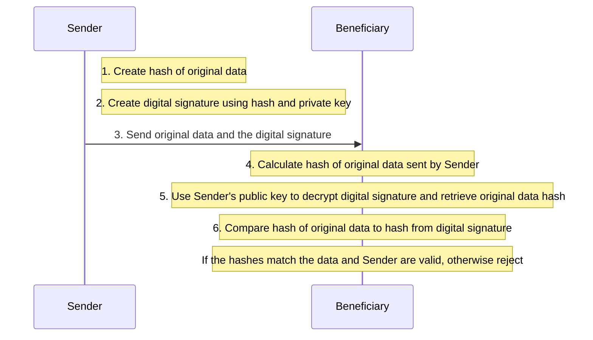

# Introduction

Crypto Wallets make interacting with a crypto blockchain easier and potentially more secure.  Like a traditional wallet the crypto wallet is a place to store, send and receive cryptocurrency.  It also holds the public and private keys which are necessary for sending and receiving cryptocurrency.

## Public and Private Keys

Public and private keys are used to create digital signatures that are used to authenticate transactions. Private keys are used to sign transactions. Both public and private keys are viewed as strings of characters and are mathematically realted. They are mathematically related. The relationship between the two keys is a one way function: a public key can be created from a private key, but a private key cannot be created from a public key.  

The format and length of the keys is determined by the algorithm used to create them.  [**RSA** and **ECC** algorithms](https://blog.cloudflare.com/a-relatively-easy-to-understand-primer-on-elliptic-curve-cryptography) are commonly used to create public and private keys.   

For security purposes never reveal a private key.  It's helpful to think of a private key as a password and a public key as a user ID or email address.  It's OK to share a public key, but not a private key.  

Wallets generate and hold both of these keys.  The wallet may also provide a pass phrase that can be used to recover the private key if it is lost.  It's a good idea to store the passphrase and the private key offline for increased security.

Learn more about the [details and math](https://learnmeabitcoin.com/beginners/guide/digital-signatures/) used to create a digital signature.

## Digitally Signing a Transaction

Consider a transaction where currency is sent from one user to another through the blockchain: 

1. The sender creates a hash of the **original data**. This data would contain instructions for tranferring currency.  A hash is a oneway encryption that serves as a fingerprint for the data.
1. The sender encyrpts the hash with their private key and this creates the **digital signature**.
2. The **original data** and the **digital signature** are sent to the benficiary.  On the blockchain, this means the message is addressed using the public key of the benficiary.
3.  The beneficiary calculates the hash of the data received using the same function as the sender.
4.  Next, the beneficiary uses the senders public key to decrypt the digital signature.  In decrypting the digital signature, the receiver has access to the **original data** hash.
5. The receiver compares the hash of the original data extracted from the digital signature to the hash created in step 4 above.  

If the hashes match: 
* the signature is valid 
* the data has not been altered
* the data comes from the sender

If the hashes don't match:
* the signature is invalid
* the data is not be trusted

When digital signature validation fails, the message is returned as invalid.

